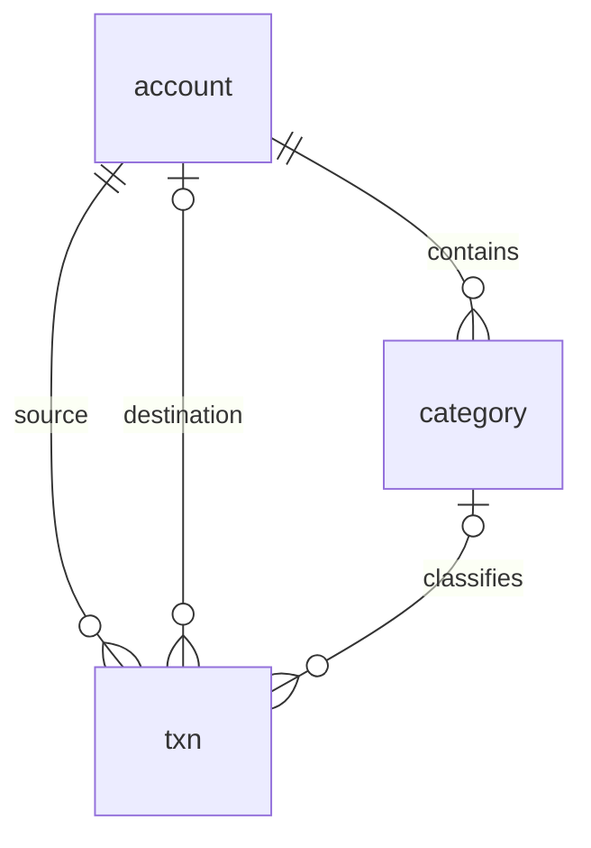

# 架构与代码导读

已确认的产品边界见 [文档入口](README.md)，运行维护见 [OPERATIONS.md](OPERATIONS.md)。共享服务器方案由 agent-config 的 server-operations 维护，不在本项目重复保存全局配置。

## 请求怎样运行

浏览器先请求页面地址。Go 返回嵌入的 index.html 和带哈希的 JS/CSS；Vue Router 将 /transactions 挂载为持久工作台，manage、add、batch、txn/:id/edit 是其子路由，在侧面板里渲染。根路径进入明细；旧 /overview、/search、/reports、/accounts 和录入链接分别重定向到工作台视图或面板，保留适用参数；旧搜索默认查询全部时间。Go 只区分 API、静态资源和页面入口，不在后端逐页渲染 Vue。

router/lazyPage.ts 用同步路由容器承接异步页面模块，导航先完成，标题和选中项立即变化；模块下载期间由 PageSkeleton 显示占位，下载失败提供重新加载入口。骨架屏覆盖元数据、首批结果与筛选更新；失败退出加载态并提供重试。工作台持续保留背景和筛选，面板关闭后重新读取数据。

多应用服务器在构建时指定 BASE_PATH=/ledger/，Vue 资源、路由和 API 共用同一个前缀。共享 Nginx 接收 /ledger/ 并去掉前缀，转发到仅监听 127.0.0.1:18080 的 Go 服务；其他路径不交给 Ledger。Host 原样保留，使同源校验在代理后仍然有效。

Vue 页面调用 api/index.ts 中明确的函数。client.ts 发一次 fetch、解析错误，不自动重试写入。HTTP handler 解码固定 JSON 类型，再调用 ledger 包的方法；只有 ledger 包接触 SQL。没有仓储接口套层、ORM、事件总线或本地账本。

SQLite 使用 WAL、外键和一个连接。多步保存用事务，普通查询直接 SQL。transactions/query 的计数、当前页和日小计在同一读事务中完成。跨接口统计允许其他窗口写入后需要刷新，符合单人使用场景。

## 页面与共享组件

| 组件 | 内容与主要交互 |
| --- | --- |
| Workspace.vue | 账户范围、余额、日期/搜索/筛选、汇总、分页明细、详情与临时排除；管理嵌套面板、焦点、断网重连和路由状态 |
| InsightView.vue | 同一范围的每日收支走势、分类比例与排名、年化和支出热力图；分类下钻切回明细 |
| Accounts.vue | 账户/分类管理面板；初始余额、总额开关、颜色、普通/专项、期间、归档、增删改及拖动/按钮排序；选中账户后查看流水 |
| AddTxn.vue / BatchImport.vue | 单笔新建/编辑/复制/删除与桌面计算器；文本解析、逐行编辑、批量修改、校验和原子保存；EntryTabs 保留账户上下文 |

App.vue 只挂载 RouterView 与 ToastHost。Workspace 负责应用布局和侧面板；tokens.css 定义颜色与控件，base.css 定义工作台、紧凑交易列、侧面板及响应式布局。桌面工作台居中、最大宽度 1240px，侧面板与工作台右边缘对齐，避免内容在大屏两端分散。手机将账户范围收进顶栏，交易行合并辅助列，侧面板全屏显示。背景设为 inert，面板支持 Escape、焦点约束及关闭后焦点恢复；原生 ModalDialog 管理详情之外的确认/实体编辑弹窗，busy 时禁止关闭。保存状态继续使用 SaveStatus。

FilterPanel 提供多选类型/账户/分类、可移除条件标签与金额校验；唯一查询状态由 Workspace 构建，路由变化可反向恢复条件。InsightView 直接展示后端逐日数据，ExpenseHeatmap 保留逐日支出与键盘查看。列表不请求每日图表数据；全部时间的图表先查首尾交易日期，超过 3661 天时提示缩小图表范围，汇总、分类和明细仍使用完整筛选。图表读取失败不会清空账目。

## 数据关系

交易的 amount 始终为正整数分，type 区分收入、支出、转账。转账只占一行：account_id 是转出端，to_account_id 是转入端。余额根据初始余额和所有有效交易实时计算。转账不会增加全局收入或支出。

分类属于一个账户，同名分类允许存在于不同账户。洞察按名称合并；单账户范围只包含该账户交易，管理面板按分类 ID 编辑。

is_delete 只标记账户、分类和交易三张实体表。删除分类时显式解除有效交易引用；删除账户前检查有效分类和两端交易。归档账户仍允许记账。没有数据库设置表，浏览器只保留最近搜索和显示偏好。

## 跟读：保存一笔

1. AddTxn.vue 管理表单和数字键盘，短算式由 expr.ts 求值，金额由 money.ts 转成分。
2. save 检查 saving，构造完整 TransactionInput。编辑和新增使用相同字段；日期只传 YYYY-MM-DD。SaveStatus 原生模态框显示等待状态，背景不可操作，useSaveGuard 阻止站内返回/切页，并在刷新或关闭时请求浏览器的离开提示。
3. txnService.create/update 使用异步 fetch 并 await 完整响应，不阻塞浏览器主线程；用户流程等待确认才结束。请求超时为 30 秒，不自动重试。明确校验失败可回表单修改；网络中断、响应损坏或服务异常等无法确认保存结果时保留表单、持续提示先查看账目，并禁用当前表单再次提交。
4. server.go 检查 JSON、必填字段和请求来源，调用 Store.SaveTransaction。
5. transactions.go 校验金额、北京日期、账户、分类；更新时同日期保留原 time。
6. 同一事务保存交易，并读取响应实体。事务提交成功后 HTTP 返回；前端才清空表单或返回。

批量记账复用相同领域验证和 SaveStatus 等待界面，保存期间禁止离开和重复提交，确认成功后才清空批次；不确定结果需核对后再决定下一步。batch.go 额外解析逐行十进制金额并返回错误及合计，确认保存时重新校验整批；任何一行不合法就回滚。

离开提示受浏览器限制，不能阻止系统强制关闭 App 或终止浏览器。没有离线草稿持久化或自动补交；保存结果不明时以服务器账目核对为准。

## FabricWorld 联动

交易响应的 fabricWorldEligible 由服务端按有效账户名“副业”、所属分类名“纺织”和 expense 判断。AddTxn 在创建成功后自动显示 FabricWorldSync；SaveBatch 返回 fabricWorldTransactions，批量页依次询问。Workspace 的交易详情弹窗与 AddTxn 的已有交易编辑页按服务器返回的资格显示“同步至 FabricWorld”按钮，手动打开同一弹窗。编辑页比较当前表单与已保存交易，有未保存修改时禁用同步并提示先保存；手动同步不提交交易表单。取消或成功后不跳转均留在原详情，重复同步返回既有布料。保存编辑不自动触发同步，重命名账户/分类后按新名称判断。

用户同意后 POST /transactions/:id/fabricworld。Ledger 从自己的数据库重新读取交易，通过 LEDGER_FABRICWORLD_URL（默认 http://127.0.0.1:18082）调用 FabricWorld 的 /api/integrations/ledger。浏览器不能指定目标 URL 或覆盖金额/名称，服务端 HTTP 超时 12 秒，不自动重试。

FabricWorld 用交易 ID 作为持久幂等来源，保存日期、整数分转换后的总价和标题；名称为空使用“未命名布料”。布料默认未使用，一组未知尺寸、1 片，其他资料留空。成功返回同源 /fabricworld/fabrics/:id/edit。重试不会再次记账、创建重复布料或覆盖补填资料；目标布料已删除时提示核对/恢复。账目后续修改、删除不会自动改变布料。

同步弹窗使用原生 dialog，保存中阻止重复点击与导航。同步请求可在网络失败后手动重试，普通交易写入仍遵守未知结果不盲目重试规则。每个服务仍独立数据库、发布、备份；不做跨库事务或持续双向同步。

联动回归：先在两个相邻 checkout 构建本机程序（Ledger 使用 make build BASE_PATH=/ledger/，FabricWorld 使用 make build），再运行 node scripts/fabricworld-e2e.mjs。依赖 FabricWorld 已安装的 Playwright 与 Chrome，可用 FABRICWORLD_CHECKOUT 指定路径。脚本只在临时数据目录写入，监听本机 19080–19082；覆盖 320/375/1440 px、新建与已有交易两种入口、取消、非目标交易、未保存修改保护、失败、提交后响应丢失、手动重试、重复同步不重新记账或建布料、字段映射、照片补填与编辑跳转，截图位于忽略的 var/fabricworld-verification。真实手机系统相机未自动化验证。

## 跟读：筛选交易并统计

1. Workspace.vue 将控件状态组成 TransactionFilter，关键词输入防抖 180ms。临时排除 ID 也放入 filter。关键词、字段、账户、分类、类型、金额、排序和排除项保存在路由查询参数中，编辑返回时恢复；月份复用 useSelectedMonth 的会话状态。
2. 同一个 filter 分别传 query 和 summary；page、sortBy、sortDir 只影响 query。
3. filters.go 用固定列和参数化 SQL 生成 WHERE。日期范围按北京时间转换，关键词在指定字段作 Unicode 小写字面匹配。
4. transactions.go 用 COUNT、ORDER BY、LIMIT/OFFSET 取当前页。工作台额外请求本页涉及日期的完整日小计。
5. statistics.go 用 SQL 聚合完整筛选集，再用 Go 算年化、补齐每日日期和热力等级。
6. 前端只绘图、格式化和排列当前页。翻页不重新请求统计，筛选变化回第一页。请求序号只防止迟到响应覆盖新选择。

projectScope 由页面显式选择，后端不识别页面名称。账本和分析默认 selected：未选账户时排除专项，明确选中时纳入对应专项。左侧或顶栏选择普通账户时按月、选择专项时默认全部时间；统一时间选择器可随时改为月或其他范围。单账户的流入、流出和净流入包含两端转账，全局收支不包含转账。

洞察切回明细共享日期范围、账户、金额和关键词，分类下钻追加分类与对应收支类型；分类按名称跨账户合并。未分类行只展示统计，不生成缺少分类条件的跳转。账本收到已不存在的分类名称时返回空结果，避免陈旧链接意外展示全部交易。

## 连接与维护边界

API 不缓存；账目不会落 localStorage 或 Service Worker。检测断网后隐藏页面内容并禁写，手动连接检查成功后重新读取列表。回到页面会刷新，录入表单保留当前草稿。没有心跳、轮询或离线写队列。

maintenance.go 提供一致性备份、恢复到新文件、显式升级副本与只读检查。schema.sql 创建版本 2，仅包含账户、分类和交易；migrations/002_remove_tags.sql 在版本 1 的升级副本中删除标签及交易关联表。serve/check/backup 要求版本 2，不自动修改旧库；restore 保持来源版本，migrate 只接受版本 1 并生成新的版本 2 文件。升级与回退见 OPERATIONS.md。部署依靠 systemd 启停程序和定时备份；服务器数据库是唯一正式数据来源。

SQLite 嵌入应用，不运行单独数据库服务。每个应用独立持有数据库文件；Ledger 的程序、配置、数据和备份集中在 /opt/ledger 的不同子目录。程序和配置由 root 管理，ledger 用户只可写自己的 data 和 backups。
