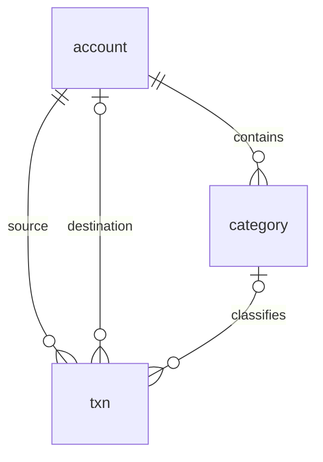

# 架构与代码导读

已确认的产品边界见 [文档入口](README.md)，运行维护见 [OPERATIONS.md](OPERATIONS.md)。共享服务器方案由 agent-config 的 server-operations 维护，不在本项目重复保存全局配置。

## 请求怎样运行

浏览器先请求页面地址。Go 返回嵌入的 index.html 和带哈希的 JS/CSS；Vue Router 将 /transactions 挂载为持久工作台，manage、add、batch、txn/:id/edit 是其子路由，在侧面板里渲染。根路径进入明细；旧 /overview、/search、/reports、/accounts 和录入链接分别重定向到工作台视图或面板，保留适用参数；旧搜索默认查询全部时间。Go 只区分 API、静态资源和页面入口，不在后端逐页渲染 Vue。

router/lazyPage.ts 用同步路由容器承接异步页面模块，导航先完成，标题和选中项立即变化；模块下载期间由 PageSkeleton 显示占位，下载失败提供重新加载入口。骨架屏覆盖元数据、首批结果与筛选更新；失败退出加载态并提供重试。工作台持续保留背景和筛选，面板关闭后重新读取数据。

工作台滚动发生在 .work-area。Workspace 在 loading 从 false 变为 true、DOM 更新之前测量原结果容器高度，并立即写入 min-height 保留空间；点击分页后移除带焦点的控件会触发布局计算，必须在 Vue 替换子节点前完成占位，不能只等待父节点样式绑定更新。加载完成后由样式绑定随新内容一并释放高度；连续切换共用同一次高度保留，过期请求不能提前解除加载状态。.work-area 关闭浏览器滚动锚定，视图内容替换时保留数值滚动位置，不以结果里的某一条记录作为锚点。切换页码、每页条数、视图与月份不主动 scrollTo，也不在完成时强制恢复旧位置，用户等待期间仍可滚动；新内容不足时按浏览器自然边界收缩，不永久填充空白。回归逐帧检查桌面与 375px 手机的实际分页点击、每页条数、末页边界、视图/月切换、慢请求、快速连续操作和减少动效。

多应用服务器在构建时指定 BASE_PATH=/ledger/，Vue 资源、路由和 API 共用同一个前缀。共享 Nginx 接收 /ledger/ 并去掉前缀，转发到仅监听 127.0.0.1:18080 的 Go 服务；其他路径不交给 Ledger。Host 原样保留，使同源校验在代理后仍然有效。

Vue 页面调用 api/index.ts 中明确的函数。client.ts 发一次 fetch、解析错误，不自动重试写入。HTTP handler 解码固定 JSON 类型，再调用 ledger 包的方法；只有 ledger 包接触 SQL。没有仓储接口套层、ORM、事件总线或本地账本。

SQLite 使用 WAL、外键和一个连接。多步保存用事务，普通查询直接 SQL。transactions/query 的计数、当前页和日小计在同一读事务中完成。跨接口统计允许其他窗口写入后需要刷新，符合单人使用场景。

## 页面与共享组件

| 组件 | 内容与主要交互 |
| --- | --- |
| Workspace.vue | 账户范围、余额、日期/搜索/筛选、汇总、分页明细、详情与临时排除；管理嵌套面板、焦点、断网重连和路由状态 |
| InsightView.vue | 同一范围的收支走势（按日/月/年汇总）、分类比例与排名、年化和按月排列的每日支出日历；分类下钻切回明细 |
| InsightTransactions.vue | 图表点击位置旁的区间收支浮窗；沿用工作台筛选，以金额降序分页读取，只展示标题和数额 |
| Accounts.vue | 账户/分类管理面板；初始余额、总额开关、颜色、普通/专项、期间、归档、增删改及拖动/按钮排序；选中账户后查看流水 |
| AddTxn.vue / BatchImport.vue | 单笔新建/编辑/复制/删除与桌面计算器；文本解析、逐行编辑、批量修改、校验和原子保存；EntryTabs 保留账户上下文 |

App.vue 只挂载 RouterView 与 ToastHost。Workspace 负责应用布局和侧面板；tokens.css 定义颜色与控件，base.css 定义工作台、紧凑交易列、侧面板及响应式布局。桌面工作台居中、最大宽度 1240px，侧面板与工作台右边缘对齐，避免内容在大屏两端分散。手机将账户范围收进顶栏，交易行合并辅助列，侧面板全屏显示。背景设为 inert，面板支持 Escape、焦点约束及关闭后焦点恢复；原生 ModalDialog 管理详情之外的确认/实体编辑弹窗，busy 时禁止关闭。保存状态继续使用 SaveStatus。交易行图标、分类标签和详情分类标识按分类 ID 使用保存的颜色（包括不同账户下的同名分类）；金额仍按收入/支出/转账着色，未分类和转账采用默认样式。

视觉体系使用暖白背景、墨绿主色、浅色边框与小范围阴影。桌面账户栏的余额卡、四项汇总卡和交易内容容器形成层级；850px 以下用顶部总额卡，600px 以下把收支并列、净额独占一行并隐藏年化卡。趋势图与金额统一使用收入绿、支出陶红，分类统计仍使用图表调色板。单笔录入的金额底色随交易类型改变，保存栏粘在面板底部；管理、批量和详情共用控件与圆角规则。

600px 及以下顶栏隐藏管理、批量和记一笔的直接按钮，账本选择框带浅色边框并靠右紧邻 WorkspaceMenu 三横线按钮。“账户管理”在下拉菜单中，批量记账通过浮动“记一笔”进入 EntryTabs。菜单有轻量展开/收起过渡，点击外部、Escape、路由或断点变化时关闭；Tab 和左右方向键收起菜单后继续工作台快捷键。打开管理面板前将焦点交回菜单按钮，关闭面板后恢复到该按钮。桌面保留原有操作栏，菜单监听随组件卸载清理。

网站标识采用墨绿渐变底、暖白 L 形账页和两条账目短线，其中一条为浅金色。web/public/favicon.svg 是图形源，工作台左上角复用同一 SVG；页面内的功能图标仍使用 AppIcon。浏览器同时提供 SVG 与 32px PNG，iOS 使用 180px 满底色图标，manifest 提供 192/512px 常规图标及 512px maskable 图标。满底色版本由系统裁切外形，主体位于 maskable 安全圆内，避免双重圆角或裁掉标识。所有图标均由本地资源提供，URL 带图形版本参数以更新旧 favicon 缓存。修改 SVG 后运行 node scripts/generate-icons.mjs 重新生成 PNG，复用 UI 回归的 Playwright/Chrome 环境（FABRICWORLD_CHECKOUT/PW_CHANNEL 可覆盖），无需增加运行依赖。

动效以 CSS 与 Vue Transition 实现，不增加动画依赖：按钮按压、选项卡指示块滑动、视图淡入、筛选高度展开、侧面板与遮罩开合、原生弹窗入场。动画约 160–320ms；金额直接展示服务器结果，不使用滚动数字。明细/洞察保留 tab/tabpanel 关联与当前视图状态，切换保持同一筛选；面板退场时禁用指针事件，保存和离开保护仍由原有逻辑决定。所有动效遵循 prefers-reduced-motion，读取/保存状态无需动画也可辨认。移除全局焦点描边，以及搜索、金额和输入框获得焦点时的边框/光晕，不改变当前视图、筛选或交易类型的状态色。

Workspace 在捕获阶段统一处理主页面快捷键：Tab / Shift+Tab 切换明细与洞察并释放当前焦点，不沿控件顺序移动；左右方向键只在按月范围内调用月份切换，其他范围不改变日期或图表选中项。输入框与可编辑文字保留原生光标操作，组合键与输入法组合输入不被接管。面板、原生弹窗或离线界面打开时不触发背景快捷键。MonthSwitch 仅负责月份按钮和标签，月份边界由 Workspace 初始化及返回刷新统一读取，不再单独监听方向键、窗口焦点或路由。AddTxn 在捕获阶段把 Tab 限定为金额、标题、备注的循环，Shift+Tab 反向；桌面金额使用计算器区域，手机使用原生金额输入。加载中没有字段时不跳往其他控件，弹窗和保存等待时交还模态框管理焦点；管理与批量面板继续使用原有焦点约束。新建和复制表单加载完成后由 AddTxn 聚焦金额（Workspace 打开面板时只在焦点不在面板内时才聚焦关闭按钮）；AddTxn 同样在捕获阶段先于面板拦截 Escape，首次按下显示底部提示并开始 2 秒计时，计时内再次按下才返回，长按产生的重复按键忽略。加载、错误、无账户、弹窗和保存等待时不拦截，编辑交易保持单次 Escape 关闭。

UI 回归先运行 make build BASE_PATH=/ledger/，再运行 node scripts/ui-e2e.mjs，依赖相邻 FabricWorld checkout 已安装的 Playwright 与 Chrome（可通过 FABRICWORLD_CHECKOUT/PW_CHANNEL 指定）。脚本创建并清理合成临时数据库，通过本机 19190/19191 验证业务流程、筛选与焦点恢复、普通/减少动效模式，以及 320/375/768/1440px 下的页面和弹窗。截图在忽略的 var/ui-verification；不访问生产账本。

FilterPanel 提供多选类型/账户/分类、可移除条件标签与金额校验；唯一查询状态由 Workspace 构建，路由变化可反向恢复条件。InsightView 使用后端逐日数据，services/insightData.ts 仅做显示分组：62 天以内保留每日柱状图，63–730 天按月相加，更长按年相加；所有金额保持整数分，部分月/年显示实际起止日期。走势图悬停显示区间金额，点击打开收支明细浮窗。列表不请求每日图表数据；全部时间的图表先查首尾交易日期，超过 3661 天时提示缩小图表范围，汇总、分类和明细仍使用完整筛选。图表读取失败不会清空账目。

InsightTransactions 接收图表块的实际起止日期与点击坐标，通过 services/insightTransactions.ts 将日期与 Workspace 的 TransactionFilter 取交集。账户、分类、类型、金额、关键词、临时排除与专项范围均保留；仅查询 income/expense，转账不属于图表收支。类型仅选转账或日期交集为空时直接显示无收支，避免空 types 在 API 中变成无限制。复用 transactions/query，每页 30 笔、sortBy=amount/sortDir=desc，收入与支出按整数分金额混排，后续页由“加载更多”读取。没有标题时显示“未命名交易”，不展示备注或账户。请求序号在切换/卸载后丢弃旧结果，失败保留已加载记录且允许重试；读取只影响浮窗，不切换 Workspace loading 或路由。

浮窗 Teleport 到 body，使用 fixed 坐标与 ResizeObserver 在加载后重新测量；空间不足时翻到点击位置另一侧并限制在可视窗口内。内部列表限高滚动，主图表与滚动位置保持不变。点击外部、Escape、外部滚动、窗口尺寸、路由、筛选、图表数据或日历年份变化时关闭；内部滚动不会关闭，主页面 Tab/方向键规则沿用。记录打开时的滚动位置，忽略点击前已发生滚动的迟到事件，避免浮窗刚打开就被关闭。监听与观察器随卸载清理，进场淡入与局部加载动效遵循减少动态效果。构建后运行 node scripts/insight-popup-e2e.mjs，以合成临时数据覆盖日期/月份/年份边界、金额排序与分页、混合收支、筛选与排除、快速点击和失败重试，以及桌面和 375/320px 手机的视口边界和滚动稳定；与 ui-e2e.mjs 使用相同端口，顺序执行。

分类统计接口一次返回各分类的收入和支出；InsightView 的方向切换只在本地筛选、排序和展示，不触发 Workspace 的筛选监听、整页加载或额外请求。切换仅在分类区域显示 220ms 淡入淡出和细进度条；两种内容占同一网格位置，高度取较高者，避免分类数不同导致日历和滚动位置跳动。隐藏内容设置 aria-hidden 与 inert，过渡期间分类下钻暂不可点击，收支切换按钮始终可用；快速点击以最后选择为准，卸载时清理计时器。减少动态效果时立即切换。分类下钻仍使用当前方向与分类，日期和账户筛选不变。浏览器回归逐帧检查桌面与 375px 手机的走势图、日历、汇总节点及位置保持不变，并验证零额外请求、快速切换、减少动效和收入分类下钻。

ExpenseHeatmap 按月显示七列日历，显示日期数字与当前筛选下的月合计，只排列 API 返回的日期；不补入范围外日期。跨年时默认最近一年，年份选择只更换可见日历，不改变完整筛选总额、分类或后端给出的热力等级。当前年份只有一个可见月份时，日历占满每日支出区域，放大日期、标题与格间距，日期格高度最多 56px；整月或月内短范围均适用。多个可见月份保持紧凑排列，手机每行两个月；短范围跨月时也按实际月份数布局。悬停日期显示当天支出，点击打开当天收支浮窗，不显示日期选中描边，也不接管方向键或 Home/End。日历列使用 minmax(0, 1fr)，父网格与子项明确 min-width: 0，避免全年日历的固有宽度撑开页面；洞察内容宽度不超过 650px 时分类与日历纵向排列。

走势图的非零收入与支出保留至少 4 CSS 像素的柱高；零值不绘出柱形。ResizeObserver 按 SVG 实际缩放换算最低高度，手机缩小后仍可辨认；顶部位置与柱高使用同一计算，底部固定在零基线。正常金额仍按比例显示，悬停/点击提示与统计始终使用真实金额，图下说明最低高度的显示规则。

ExpenseHeatmap 按 beijingDate 标记当前日期，只有可见月份中实际存在今天时才显示金色边框、角落光点和“今天”图例，添加 aria-current=date 与日期提示。动效只改变内部光晕，不改变格子尺寸或支出等级底色；减少动态效果时保留静态标记。本地计时器在下一次北京时间午夜更新，窗口 focus/visibilitychange 时校准，不请求 API；卸载时清理计时器和监听。

全年回归额外检查 320/375/768/900/1440/1920px 下 work-area、洞察网格、分类与日历的实际 scrollWidth 和边界，而不只检查 document 宽度；同时验证本年 12 个月趋势、跨年切换、闰年 366 个日期与点击查看金额。极端金额差异回归使用合成响应，在桌面和手机实测 0.01 元非零柱高、零值不可见、统一基线和真实金额提示。键盘回归在 1440/375px 验证主页面 Tab 切视图、方向键切月份、文字光标与弹窗隔离、单笔三个字段正反循环、记一笔打开即聚焦金额与两次 Esc 关闭（含超时后需重新确认），以及移除焦点高亮后输入和草稿仍正确。

Pagination 显示总条数、上一页/下一页、数字页码和每页条数选择，使用统一主色标识当前页并设置 aria-current。默认 10 条，可选 20/50/100 条；选择后 Workspace 回到第一页，仅重新查询交易与日小计，保留筛选和排序，汇总继续统计全部匹配交易。桌面最多显示七个页码/省略号位置，手机最多五个并另起一行，始终保留首尾页与当前页。API 默认 50 条的契约不变，工作台显式传 pageSize。

## 数据关系

交易的 amount 始终为正整数分，type 区分收入、支出、转账。转账只占一行：account_id 是转出端，to_account_id 是转入端。余额根据初始余额和所有有效交易实时计算。转账不会增加全局收入或支出。

分类属于一个账户，同名分类允许存在于不同账户。洞察按名称合并；单账户范围只包含该账户交易，管理面板按分类 ID 编辑。

is_delete 只标记账户、分类和交易三张实体表。删除分类时显式解除有效交易引用；删除账户前检查有效分类和两端交易。归档账户仍允许记账。没有数据库设置表，浏览器只保留最近搜索和显示偏好。

## 跟读：保存一笔

1. AddTxn.vue 管理表单和数字键盘，短算式由 expr.ts 求值，金额由 money.ts 转成分。
2. save 检查 saving，构造完整 TransactionInput。编辑和新增使用相同字段；日期只传 YYYY-MM-DD。SaveStatus 原生模态框显示等待状态，背景不可操作，useSaveGuard 阻止站内返回/切页，并在刷新或关闭时请求浏览器的离开提示。
3. txnService.create/update 使用异步 fetch 并 await 完整响应，不阻塞浏览器主线程；用户流程等待确认才结束。请求超时为 30 秒，不自动重试。明确校验失败可回表单修改；网络中断、响应损坏或服务异常等无法确认保存结果时保留表单、持续提示先查看账目，并禁用当前表单再次提交。
4. server.go 检查 JSON、必填字段和请求来源，调用 Store.SaveTransaction。
5. transactions.go 校验金额、北京日期、账户、分类；更新时同日期保留原 time。
6. 同一事务保存交易，并读取响应实体。事务提交成功后 HTTP 返回；前端才清空表单或返回。

批量记账复用相同领域验证和 SaveStatus 等待界面，保存期间禁止离开和重复提交，确认成功后才清空批次；不确定结果需核对后再决定下一步。batch.go 额外解析逐行十进制金额并返回错误及合计，确认保存时重新校验整批；任何一行不合法就回滚。

离开提示受浏览器限制，不能阻止系统强制关闭 App 或终止浏览器。没有离线草稿持久化或自动补交；保存结果不明时以服务器账目核对为准。

## FabricWorld 联动

交易响应的 fabricWorldEligible 由服务端按有效账户名“副业”、所属分类名“纺织”和 expense 判断。AddTxn 在创建成功后自动显示 FabricWorldSync；SaveBatch 返回 fabricWorldTransactions，批量页依次询问。Workspace 的交易详情弹窗与 AddTxn 的已有交易编辑页按服务器返回的资格显示“同步至 FabricWorld”按钮，手动打开同一弹窗。编辑页比较当前表单与已保存交易，有未保存修改时禁用同步并提示先保存；手动同步不提交交易表单。取消或成功后不跳转均留在原详情，重复同步返回既有布料。保存编辑不自动触发同步，重命名账户/分类后按新名称判断。

用户同意后 POST /transactions/:id/fabricworld。Ledger 从自己的数据库重新读取交易，通过 LEDGER_FABRICWORLD_URL（默认 http://127.0.0.1:18082）调用 FabricWorld 的 /api/integrations/ledger。浏览器不能指定目标 URL 或覆盖金额/名称，服务端 HTTP 超时 12 秒，不自动重试。

FabricWorld 用交易 ID 作为持久幂等来源，保存日期、整数分转换后的总价和标题；名称为空使用“未命名布料”。布料默认未使用，一组未知尺寸、1 片，其他资料留空。成功返回同源 /fabricworld/fabrics/:id/edit。重试不会再次记账、创建重复布料或覆盖补填资料；目标布料已删除时提示核对/恢复。账目后续修改、删除不会自动改变布料。

同步弹窗使用原生 dialog，保存中阻止重复点击与导航。同步请求可在网络失败后手动重试，普通交易写入仍遵守未知结果不盲目重试规则。每个服务仍独立数据库、发布、备份；不做跨库事务或持续双向同步。

联动回归：先在两个相邻 checkout 构建本机程序（Ledger 使用 make build BASE_PATH=/ledger/，FabricWorld 使用 make build），再运行 node scripts/fabricworld-e2e.mjs。依赖 FabricWorld 已安装的 Playwright 与 Chrome，可用 FABRICWORLD_CHECKOUT 指定路径。脚本只在临时数据目录写入，监听本机 19080–19082；覆盖 320/375/1440 px、新建与已有交易两种入口、取消、非目标交易、未保存修改保护、失败、提交后响应丢失、手动重试、重复同步不重新记账或建布料、字段映射、照片补填与编辑跳转，截图位于忽略的 var/fabricworld-verification。真实手机系统相机未自动化验证。

## 跟读：筛选交易并统计

1. Workspace.vue 将控件状态组成 TransactionFilter，关键词输入防抖 180ms。临时排除 ID 也放入 filter。关键词、字段、账户、分类、类型、金额、排序和排除项保存在路由查询参数中，编辑返回时恢复；月份复用 useSelectedMonth 的会话状态。
2. 同一个 filter 分别传 query 和 summary；page、sortBy、sortDir 只影响 query。
3. filters.go 用固定列和参数化 SQL 生成 WHERE。日期范围按北京时间转换，关键词在标题、备注、分类中作 Unicode 小写字面匹配；金额字段把关键词解析为整数分后精确匹配。
4. transactions.go 用 COUNT、ORDER BY、LIMIT/OFFSET 取当前页。工作台额外请求本页涉及日期的完整日小计。
5. statistics.go 用 SQL 聚合完整筛选集，再用 Go 算年化、补齐每日日期和热力等级。
6. 前端只绘图、格式化和排列当前页。翻页不重新请求统计，筛选变化回第一页。请求序号只防止迟到响应覆盖新选择。

projectScope 由页面显式选择，后端不识别页面名称。账本和分析默认 selected：未选账户时排除专项，明确选中时纳入对应专项。左侧或顶栏选择普通账户时按月、选择专项时默认全部时间；统一时间选择器可随时改为月或其他范围。单账户的流入、流出和净流入包含两端转账，全局收支不包含转账。

洞察切回明细共享日期范围、账户、金额和关键词，分类下钻追加分类与对应收支类型；分类按名称跨账户合并。未分类行只展示统计，不生成缺少分类条件的跳转。账本收到已不存在的分类名称时返回空结果，避免陈旧链接意外展示全部交易。

## 连接与维护边界

API 不缓存；账目不会落 localStorage 或 Service Worker。检测断网后隐藏页面内容并禁写，手动连接检查成功后重新读取列表。没有心跳、轮询或离线写队列。

usePageRefresh 监听窗口 focus、页面 visibilitychange 和 ledger-reload，只在页面可见时触发，60ms 合并同时到达的事件，请求期间不重复启动。Workspace 返回页面时在后台重新读取账户、分类、月份边界及当前页统计，保持现有内容挂载，不设置整页 loading。后台刷新沿用请求序号，用户更改筛选或翻页后丢弃旧响应；录入/管理面板、详情、同步弹窗、前台加载或断网时跳过。筛选监听只观察用户条件与日期范围，不观察刷新替换的分类对象，因此刷新不会重置页码或额外触发筛选加载。相同 JSON 结果复用原对象，避免无变化时清掉走势图和日历当前提示。后台读取失败保留已有结果并提供重试；每日图表单独失败时保留上次图表并标明更新失败，连接失败仍遵守断网禁写规则。初次打开、真正切换筛选和保存返回保留原有加载流程。浏览器回归覆盖桌面/375px 的逐帧滚动与组件稳定、重复事件、跨窗口数据更新、失败重试、旧请求竞态和录入草稿保护。

maintenance.go 提供一致性备份、恢复到新文件、显式升级副本与只读检查。schema.sql 创建版本 2，仅包含账户、分类和交易；migrations/002_remove_tags.sql 在版本 1 的升级副本中删除标签及交易关联表。serve/check/backup 要求版本 2，不自动修改旧库；restore 保持来源版本，migrate 只接受版本 1 并生成新的版本 2 文件。升级与回退见 OPERATIONS.md。部署依靠 systemd 启停程序和定时备份；服务器数据库是唯一正式数据来源。

SQLite 嵌入应用，不运行单独数据库服务。每个应用独立持有数据库文件；Ledger 的程序、配置、数据和备份集中在 /opt/ledger 的不同子目录。程序和配置由 root 管理，ledger 用户只可写自己的 data 和 backups。
