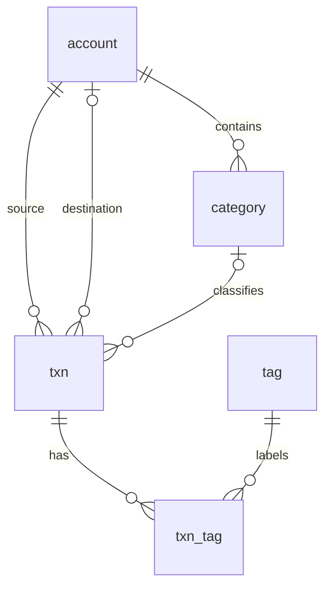

# 架构与代码导读

已确认的产品边界见 [文档入口](README.md)，运行维护见 [OPERATIONS.md](OPERATIONS.md)。共享服务器方案由 agent-config 的 server-operations 维护，不在本项目重复保存全局配置。

## 请求怎样运行

浏览器先请求页面地址。Go 返回嵌入的 index.html 和带哈希的 JS/CSS；Vue Router 接管 /overview、/accounts 等页面导航。Go 只区分 API、静态资源和页面入口，不在后端逐页渲染 Vue。

router/lazyPage.ts 用同步路由容器承接异步页面模块，导航先完成，标题和选中项立即变化；模块下载期间由 PageSkeleton 显示占位，下载失败提供重新加载入口。各页面的骨架屏继续覆盖账户/分类等元数据与首批结果的加载；搜索、报告和账户明细更新时也显示结果占位，失败退出加载态并提供重试。账户页离开后不再用迟到结果同步路由参数。

多应用服务器在构建时指定 BASE_PATH=/ledger/，Vue 资源、路由和 API 共用同一个前缀。共享 Nginx 接收 /ledger/ 并去掉前缀，转发到仅监听 127.0.0.1:18080 的 Go 服务；其他路径不交给 Ledger。Host 原样保留，使同源校验在代理后仍然有效。

Vue 页面调用 api/index.ts 中明确的函数。client.ts 发一次 fetch、解析错误，不自动重试写入。HTTP handler 解码固定 JSON 类型，再调用 ledger 包的方法；只有 ledger 包接触 SQL。没有仓储接口套层、ORM、事件总线或本地账本。

SQLite 使用 WAL、外键和一个连接。多步保存用事务，普通查询直接 SQL。transactions/query 的计数、当前页和日小计在同一读事务中完成。跨接口统计允许其他窗口写入后需要刷新，符合单人使用场景。

## 数据关系

交易的 amount 始终为正整数分，type 区分收入、支出、转账。转账只占一行：account_id 是转出端，to_account_id 是转入端。余额根据初始余额和所有有效交易实时计算。转账不会增加全局收入或支出。

分类属于一个账户，同名分类允许存在于不同账户。报告按名称合并，账户页按 ID 聚合。标签通过关联表匹配，筛选使用 EXISTS，避免一笔交易有多个标签时重复累计。

is_delete 只标记四张实体表。删除分类时显式解除有效交易引用；删除账户前检查有效分类和两端交易。归档账户仍允许记账。没有数据库设置表，浏览器只保留最近搜索和显示偏好。

## 跟读：保存一笔

1. AddTxn.vue 管理表单和数字键盘，短算式由 expr.ts 求值，金额由 money.ts 转成分。
2. save 检查 saving，构造完整 TransactionInput。编辑和新增使用相同字段；日期只传 YYYY-MM-DD。SaveStatus 原生模态框显示等待状态，背景不可操作，useSaveGuard 阻止站内返回/切页，并在刷新或关闭时请求浏览器的离开提示。
3. txnService.create/update 使用异步 fetch 并 await 完整响应，不阻塞浏览器主线程；用户流程等待确认才结束。请求超时为 30 秒，不自动重试。明确校验失败可回表单修改；网络中断、响应损坏或服务异常等无法确认保存结果时保留表单、持续提示先查看账目，并禁用当前表单再次提交。
4. server.go 检查 JSON、必填字段和请求来源，调用 Store.SaveTransaction。
5. transactions.go 校验金额、北京日期、账户、分类、标签；更新时同日期保留原 time。
6. 同一事务保存交易和标签，并读取响应实体。事务提交成功后 HTTP 返回；前端才清空表单或返回。

批量记账复用相同领域验证和 SaveStatus 等待界面，保存期间禁止离开和重复提交，确认成功后才清空批次；不确定结果需核对后再决定下一步。batch.go 额外解析逐行十进制金额并返回错误及合计，确认保存时重新校验整批；任何一行不合法就回滚。

离开提示受浏览器限制，不能阻止系统强制关闭 App 或终止浏览器。没有离线草稿持久化或自动补交；保存结果不明时以服务器账目核对为准。

## 跟读：筛选交易并统计

1. Search.vue 将控件状态组成 TransactionFilter，关键词输入防抖 200ms。临时排除 ID 也放入 filter。
2. 同一个 filter 分别传 query 和 summary；page、sortBy、sortDir 只影响 query。
3. filters.go 用固定列和参数化 SQL 生成 WHERE。日期范围按北京时间转换，关键词在指定字段作 Unicode 小写字面匹配。
4. transactions.go 用 COUNT、ORDER BY、LIMIT/OFFSET 取当前页，批量加载该页标签。概览和账户额外请求本页涉及日期的完整日小计。
5. statistics.go 用 SQL 聚合完整筛选集，再用 Go 算年化、补齐每日日期和热力等级。
6. 前端只绘图、格式化和排列当前页。翻页不重新请求统计，筛选变化回第一页。请求序号只防止迟到响应覆盖新选择。

projectScope 由页面显式选择，后端不识别页面名称。这样今后合并概览、搜索或账户详情时可以直接复用现有 API。

## 连接与维护边界

API 不缓存；账目不会落 localStorage 或 Service Worker。检测断网后隐藏页面内容并禁写，手动连接检查成功后重新读取列表。回到页面会刷新，录入表单保留当前草稿。没有心跳、轮询或离线写队列。

maintenance.go 提供一致性备份、恢复到新文件与只读检查。部署依靠 systemd 启停程序和定时备份；服务器数据库是唯一正式数据来源。

SQLite 嵌入应用，不运行单独数据库服务。每个应用独立持有数据库文件；Ledger 的程序、配置、数据和备份集中在 /opt/ledger 的不同子目录。程序和配置由 root 管理，ledger 用户只可写自己的 data 和 backups。
